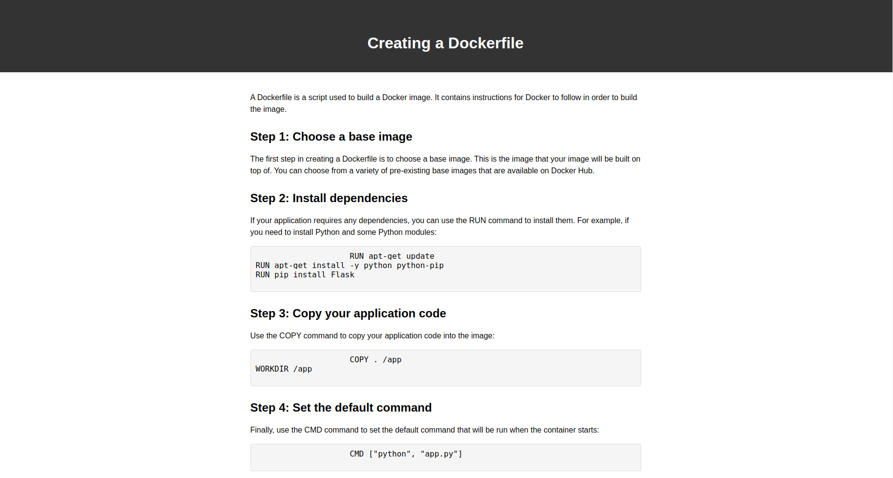

# Creating a Dockerfile

.

Acesso: https://elc1090.github.io/project1-danieldspx/

#### Desenvolvedor(a)
Daniel dos Santos Pereira

#### Cliente
Gabriel Caetano

#### Tecnologias

- HTML
- CSS

#### Ambiente de desenvolvimento

- VS Code

#### Créditos

- https://docs.docker.com/get-started/02_our_app/
- https://www.simplilearn.com/tutorials/docker-tutorial/what-is-dockerfile

#### Bastidores

Houveram várias versões mas optei pela mais simples. Houve uma dificuldade com o CSS.

---
Projeto entregue para a disciplina de [Desenvolvimento de Software para a Web](http://github.com/andreainfufsm/elc1090-2023a) em 2023a
